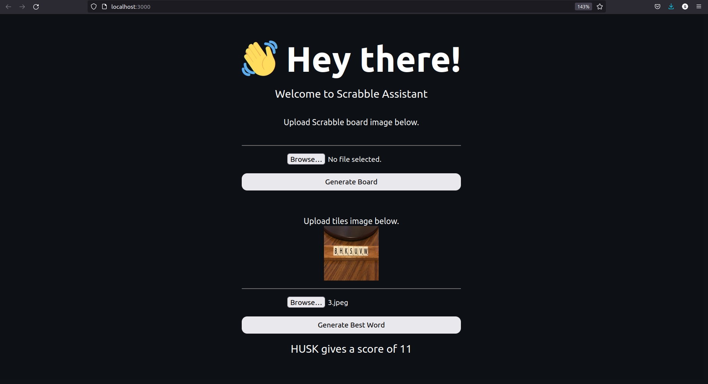
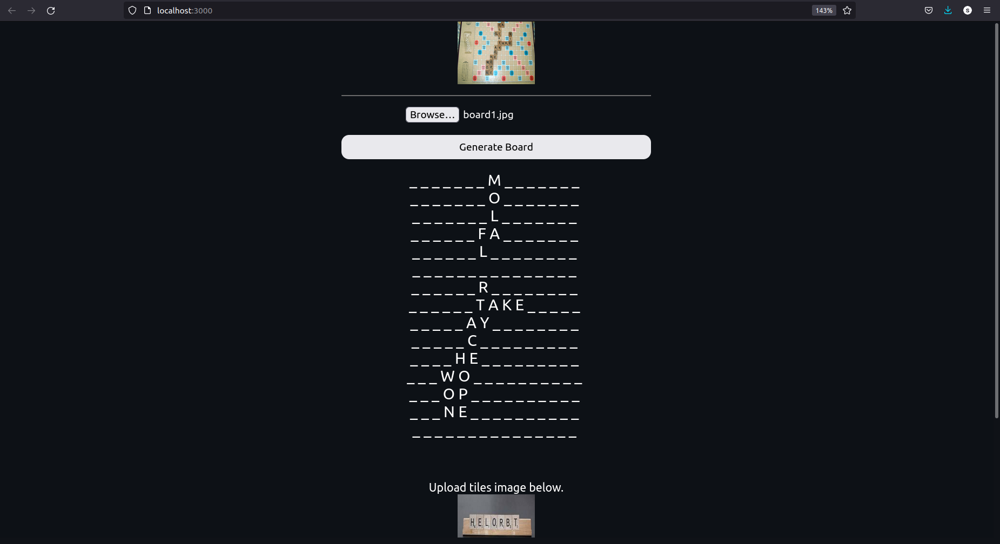
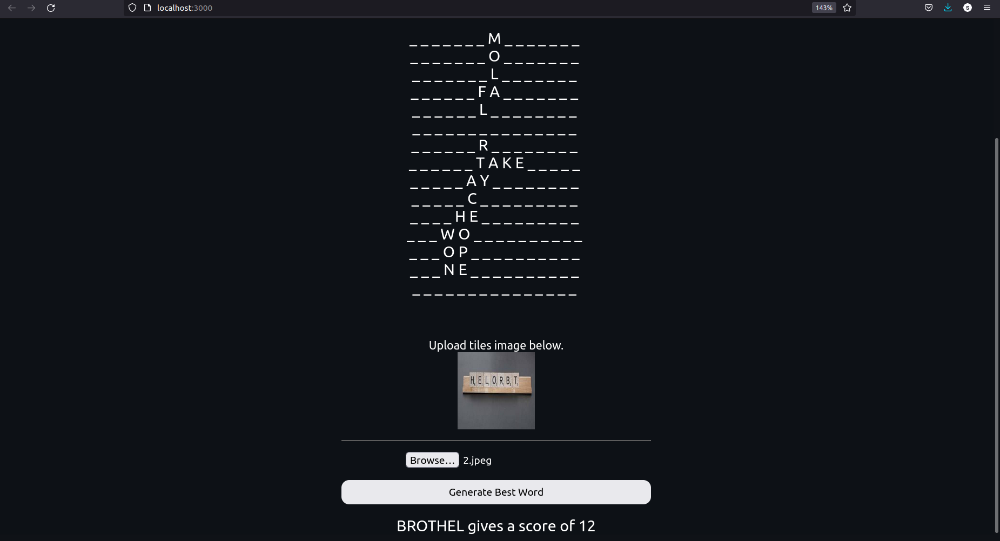
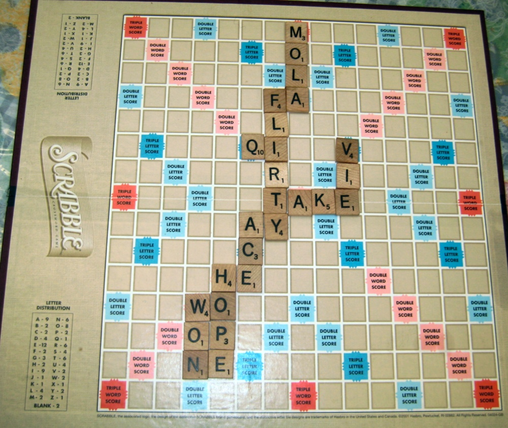
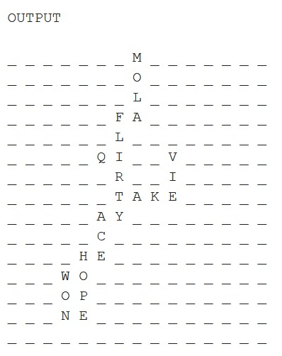
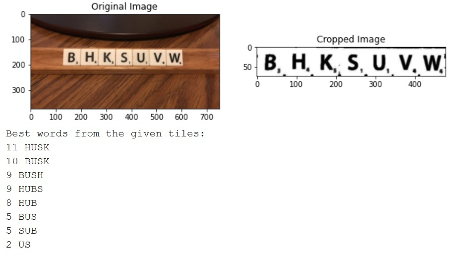

# Scrabble Assistant (Team: lena)
Digital Image Processing: Course Project (Monsoon 2021)

**Team Members**
- Shaurya Rajat Dewan (2019101017, CSE)
- Chirag Shameek Sahu (2019102006, ECE)
- Harshwardhan Prasad (2019102021, ECE)
- Shivanshu Jain (2019101001, CSE)

## Overview
This is a Graphical User Interface (GUI), that takes an image of the Scrabble board and returns the user a text matrix of the characters present on the board. Also, the GUI takes the images of the tiles and gives the best valid word for the given set of tiles.

## Goal
With the help of image processing techniques we convert the image of the Scrabble board into a 15 X 15 text matrix.

## Requirements
This project is based on the language Python 3.7.

The libraries used in this project are:
- **os** : Provides functions for creating and removing a directory (folder), fetching its contents, changing and identifying the current directory, etc
- **openCV** : Open-source library for computer vision, machine learning, and image processing
- **math** : Most popular mathematical functions are defined here, including trigonometric functions, representation functions, logarithmic functions, angle conversion functions, etc.
- **numpy** : It is a fundamental package for scientific computing in Python
- **matplotlib** : It is a cross-platform, data visualization and graphical plotting library for Python
- **pytesseract** : Optical character recognition (OCR) tool for python, which helps to recognize and “read” the text embedded in images


## How To Run The Project?
Run these lines of code in your terminal to install the required libraries and code.
```
$ git clone https://github.com/Digital-Image-Processing-IIITH/dip-project-lena.git 
$ cd dip-project-lena/src
$ apt-get install python3-OpenCV
$ sudo apt install tesseract-ocr
$ pip install -r requirements.txt
```

To run just the notebook and not the GUI, run the following command when in the 'src' folder:
```
$ jupyter notebook main.ipynb
```

To run the GUI, you will need two separate terminal sessions running parallely. In one terminal, run the following command when in the 'src/webapp' folder to run the frontend:
```
$ cd frontend
$ npm install
$ npm start
```

In the other terminal, run the following command when in the 'src/webapp' folder to run the backend:
```
$ cd backend
$ npm install
$ npm start
```

## Running The Notebook
Run all the cells of the Jupyter notebook present in the same order. For intermediate steps you will be able to see the outputs too. The necessary details of the functions are given in the markdown of the notebook.

## Using The GUI
There are 2 parts to the GUI:
1. The first part takes an image of a Scrabble board as input and returns the extracted board in matrix form. To do this, simply click on the 1st/upper 'Browse...' button, select the board image file and click 'Open' and finally click the 'Generate Board' button. Note that this segment takes upto a whole minute to run so please be patient for the output.
2. The second part takes an image of the user's 7 tiles and returns the best word suggestion with the corresponding score. To do this, simply click on the 2nd/lower 'Browse...' button, select the tiles image file and click 'Open' and finally click the 'Generate Best Word' button.

**Note: All image file formats are accepted for the above.**

## Results
- **IN GUI**

||
|:--:|
| <b>GUI Home Page</b>|

||
|:--:|
| <b>GUI Board Output</b>|

||
|:--:|
| <b>GUI Tiles/Best Word Output</b>|

- **IN JUPYTER NOTEBOOK**

||
|:--:|
| <b>Board 1 - Input to board segment</b>|

||
|:--:|
| <b>Output from board segment for above input</b>|

||
|:--:|
| <b>Input and Output of Tiles Segment</b>|


Please make sure you follow the project [guidelines](./guidelines.md) carefully.
